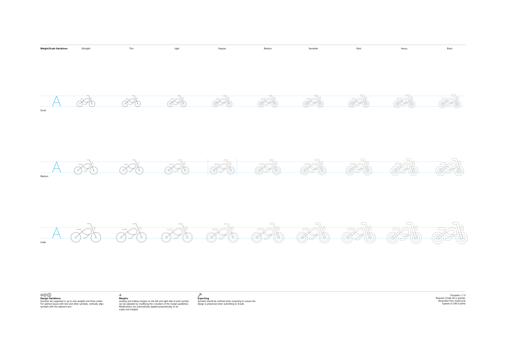
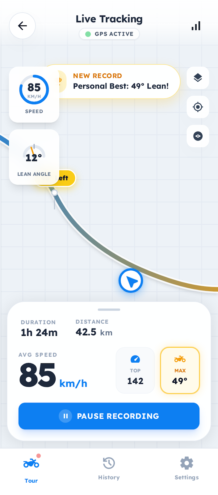
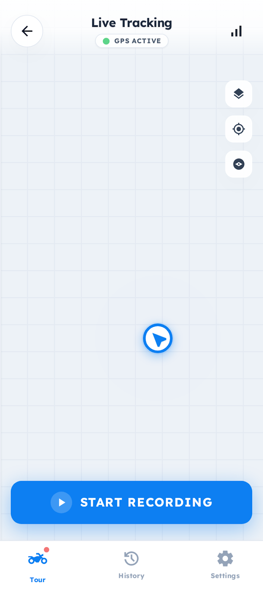
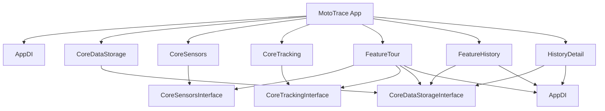

# MotoTrace



> 오토바이 라이더를 위한 실시간 라이딩 트래킹 iOS 앱

MotoTrace는 라이딩 중 속도, 뱅킹각(린앵글), 급가속/급감속 이벤트를 실시간으로 분석하고, 주행 경로와 통계를 기록하는 애플리케이션입니다.

---

## Preview

| 트래킹 중 | 트래킹 종료 후 |
|:---:|:---:|
|  |  |

---

## Features

### 🏍️ 실시간 라이딩 트래킹
- 현재 속도, 뱅킹각(린앵글) 실시간 표시
- 주행 중 경로를 지도에 실시간으로 그려줌
- 경과 시간, 주행 거리, 평균 속도 실시간 업데이트
- 일시정지 / 재개 / 종료 지원

### 📊 자동 이벤트 감지
- **급가속** — 설정 임계값(기본 16.7 km/h/s) 이상의 가속 감지
- **급감속** — 설정 임계값(기본 16.7 km/h/s) 이상의 제동 감지
- **뱅킹각** — 기준 이상(기본 30°)의 린앵글 감지 및 기록

### 🗂️ 라이딩 히스토리
- 기록된 모든 투어 목록 조회
- 투어별 상세 화면: 지도 경로(출발/도착 마커), 거리, 시간, 평균속도, 최고속도, 최대 뱅킹각

### 🔄 백그라운드 종료 후 세션 복구
- 백그라운드 트래킹 중 앱이 강제 종료되더라도 재실행 시 이전 세션 자동 복구
- 트래킹 중이었으면 센서 재개, 일시정지 상태였으면 UI 복원 후 대기

---

## Architecture

### 모듈 구조

Tuist를 사용한 멀티 모듈 구조로 구성되어 있으며, 각 모듈은 `Interface` / `Implementation` / `Tests` / `Demo` 타겟으로 분리됩니다.

```
MotoTrace
├── MotoTrace (App Target)
│   ├── AppDISetup      — 앱 시작 시 DI 조립
│   └── RootTabView     — 탭 기반 네비게이션 루트
│
├── Modules/Core
│   ├── CoreSensors     — CLLocationManager + CMMotionManager 래핑
│   │                     AsyncStream으로 위치/모션 데이터 스트리밍
│   ├── CoreTracking    — 속도·린앵글 분석 엔진
│   │                     ThresholdPolicy 기반 이벤트 감지
│   └── CoreDataStorage — SwiftData 기반 영속화 + UserDefaults 세션 관리
│
├── Modules/Feature
│   ├── FeatureTour     — 실시간 트래킹 화면 (MVI 패턴)
│   ├── FeatureHistory  — 라이딩 히스토리 목록
│   ├── HistoryDetail   — 투어 상세 화면 (지도 + 통계)
│   └── FeatureSettings — 설정 화면 (개발 중)
│
├── Modules/SharedModules
│   └── Shared          — 앱 전역 공통 타입
│
└── Modules/DI
    └── AppDI           — DI 컨테이너 (singleton / transient 스코프)
```

### 패턴

**MVI (Model-View-Intent)**
각 Feature는 `State`, `Intent`, `Store`로 구성됩니다.

```swift
// Intent: 사용자 액션
enum TourIntent {
    case startTracking(tourName: String)
    case pauseTracking
    case resumeTracking
    case stopTracking
    case restoreTracking
}

// Store: 상태 관리 + 비즈니스 로직
final class TourStore: ObservableObject {
    @Published private(set) var state: TourState
    func send(_ intent: TourIntent) { ... }
}
```

**Interface / Implementation 분리**
모든 Core 모듈은 프로토콜 기반 인터페이스를 노출하고, 구현체는 `Implementation` 타겟에 격리됩니다. Feature는 Interface에만 의존합니다.

**커스텀 DI 컨테이너**
외부 DI 라이브러리 없이 직접 구현한 `AppDIContainer`를 사용합니다.

```swift
container.register(TourRepositoryInterface.self, scope: .singleton) {
    TourRepository(modelContainer: modelContainer)
}
let repo = container.resolve(TourRepositoryInterface.self)
```

---

## Technical Details

### 센서 데이터 수집 (CoreSensors)

| 센서 | 프레임워크 | 주요 설정 |
|------|-----------|-----------|
| GPS 위치 + 속도 | `CoreLocation` | `kCLLocationAccuracyBestForNavigation`, 백그라운드 업데이트 허용 |
| 자세 (Roll/Pitch) | `CoreMotion` | `CMDeviceMotion`, 업데이트 주기 0.2초 |

두 센서 모두 `AsyncStream`으로 래핑되어 `for await` 패턴으로 소비됩니다.

### 분석 엔진 (CoreTracking)

**`SpeedAnalyzer`**
- 최근 5개 `LocationSnapshot` 슬라이딩 윈도우로 가속도 계산
- `activeEvent` 상태 머신으로 급가속·급감속 구간 추적
- 정차 기준 속도(기본 3 km/h) 이하 구간은 주행 시간/거리에서 제외

**`LeanAnalyzer`**
- 트래킹 시작 시 디바이스 기준 자세 자동 캘리브레이션
- Roll / Pitch 중 더 큰 값을 린앵글로 결정
- 일시정지 시 캘리브레이션 상태 리셋 (재개 시 재보정)

**기본 임계값 (`TrackingPolicy`)**
```swift
accelerationKmhPerSec: 16.7   // 급가속 감지 기준 — 0→100 km/h 약 6초 이내 가속
decelerationKmhPerSec: 16.7   // 급감속 감지 기준 — 100→0 km/h 약 6초 이내 제동
minLeanAngleDegrees:   30.0   // 뱅킹각 이벤트 기록 기준
stopSpeedKmh:           3.0   // 정차 판단 기준 (이하 구간은 주행 시간/거리 제외)
```

> `16.7 km/h/s` 는 `100 km/h ÷ 16.7 ≈ 6초`, 즉 **0→100 km/h 6초 이내** 가속을 급가속으로 판단하는 기준입니다. 일반 중형 오토바이가 풀 스로틀로 가속하는 수준에서 트리거됩니다.

### 데이터 저장 (CoreDataStorage)

**SwiftData (위치·이벤트·통계)**
- 위치 포인트는 50개 단위 버퍼 후 일괄 저장 (약 10초 분량)
- 주행 통계는 30회 업데이트마다 저장 (약 30초 주기)
- 최고속도·최대 뱅킹각은 갱신 시 즉시 저장

**UserDefaults (`TrackingSessionRepository`)**
- 트래킹 상태 변경(시작/일시정지/재개) 시점에만 기록 (총 4회 이하)
- 저장 항목: `tourId`, `startDate` (pause 보정 포함), `pausedAt`, `statusRaw`
- 정상 종료 시 즉시 삭제

### 백그라운드 세션 복구

```
앱 재실행
  │
  ├─ UserDefaults에 세션 없음 → idle 상태로 정상 시작
  │
  └─ 세션 있음
       │
       ├─ repository에 해당 tourId 없음 → 세션 clear, idle 시작
       │
       └─ 데이터 확인됨
            ├─ status = "tracking" → 센서 재개 + 기존 경로 지도에 복원
            └─ status = "paused"  → UI 복원, 사용자 재개 액션 대기
```

---

## Tech Stack

| 항목 | 내용 |
|------|------|
| 언어 | Swift 6 |
| UI | SwiftUI |
| 지도 | MapKit (SwiftUI native) |
| 데이터베이스 | SwiftData |
| 세션 저장 | UserDefaults |
| 센서 | CoreLocation, CoreMotion |
| 프로젝트 관리 | Tuist |
| 아키텍처 | MVI, Multi-Module, Interface/Implementation 분리 |
| DI | 자체 구현 `AppDIContainer` |
| 비동기 | Swift Concurrency (async/await, AsyncStream, Task) |
| 최소 지원 버전 | iOS 17+ |

---

## Testing

핵심 분석 로직에 대한 단위 테스트를 `XCTest` 기반으로 작성했습니다. GWT(Given-When-Then) 패턴을 사용합니다.

### 테스트 대상

**`LeanAngleAnalyzerTests`** — `CoreTracking/Tests`

| 테스트 케이스 | 검증 내용 |
|------|-----------|
| `test_updateAttitude_첫데이터로_영점이_자동으로_잡히는지_검증` | 첫 번째 모션 데이터가 들어오면 자동 캘리브레이션되어 뱅킹각이 0이 되는지 확인 |
| `test_updateAttitude_롤값_변화시_뱅킹각이_올바르게_계산되는지` | Roll 10° 기준에서 25°로 기울었을 때 뱅킹각이 정확히 15°로 계산되는지 확인 |
| `test_handlePause를_호출하면_영점설정이_초기화되는지` | 일시정지 후 캘리브레이션이 초기화되고, 다음 재개 시 새 기준으로 재보정되는지 확인 |

```swift
func test_updateAttitude_롤값_변화시_뱅킹각이_올바르게_계산되는지() {
    // Given
    let initialMotion = MotionSnapshot(rollDegrees: 10.0, ...) // 기준 자세
    let leanedMotion  = MotionSnapshot(rollDegrees: 25.0, ...) // 기울어진 자세

    // When
    _ = sut.updateAttitude(initialMotion, locationSnapshot: dummyLocation) // 영점 캘리브레이션
    _ = sut.updateAttitude(leanedMotion,  locationSnapshot: dummyLocation) // 뱅킹각 계산

    // Then
    XCTAssertEqual(sut.currentLeanAngle(), 15.0) // 25 - 10 = 15°
}
```

---

## Project Setup

### 요구 사항
- Xcode 16+
- Tuist

### 실행

```bash
# 의존성 설치 및 프로젝트 생성
make generate

# 또는 직접 실행
tuist install
tuist generate
```

이후 `MotoTrace.xcworkspace`를 Xcode에서 열고 실행합니다.

---

## Module Dependency Graph


