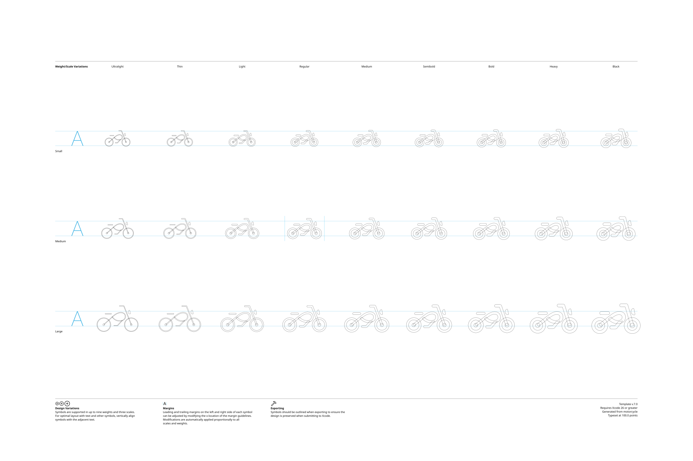
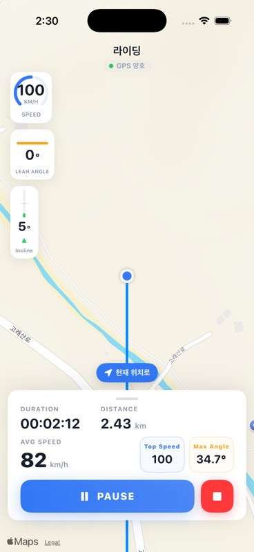
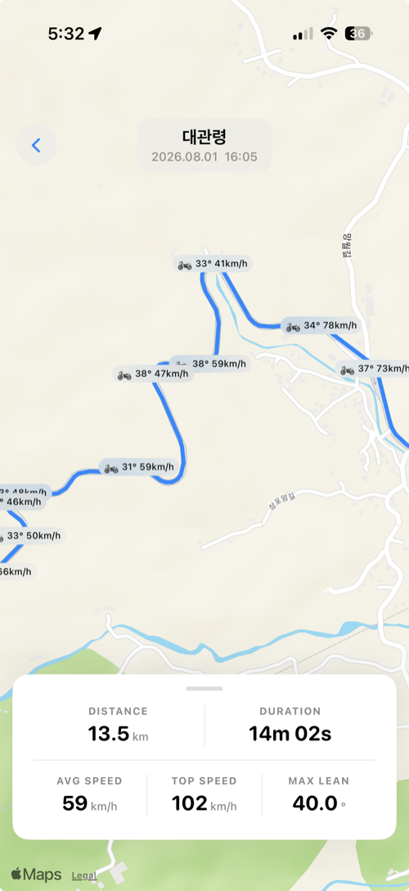
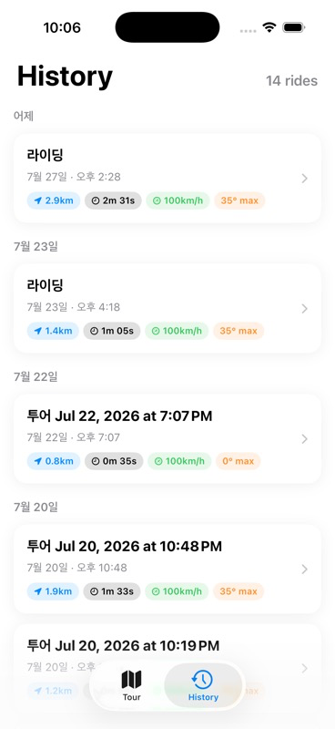
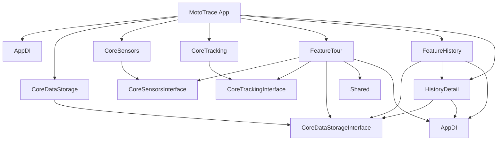

# MotoTrace



> 오토바이 라이더를 위한 실시간 라이딩 트래킹 iOS 앱

MotoTrace는 라이딩 중 속도, 뱅킹각(린앵글), 도로 경사각, 급가속/급감속 이벤트를 실시간으로 분석하고, 주행 경로와 통계를 기록하는 애플리케이션입니다.

---

## Preview

| 트래킹 중 | 투어 상세 | 라이딩 히스토리 |
|:---:|:---:|:---:|
|  |  |  |

> 실제 주행 기록입니다 (대관령, 13.5km).

---

## Features

### 🏍️ 실시간 라이딩 트래킹
- 현재 속도, 뱅킹각(린앵글), **도로 경사각** 실시간 표시
- 주행 중 경로를 지도에 실시간으로 그려줌
- 경과 시간, 주행 거리, 평균 속도 실시간 업데이트
- 일시정지 / 재개 / 종료 지원
- 주행 중에는 **화면 자동 잠금 방지**(내비처럼 켜두고 주행) + 하단 탭바 숨김으로 몰입형 화면 제공

### 📊 자동 이벤트 감지
- **급가속** — 설정 임계값(기본 16.7 km/h/s) 이상의 가속 감지
- **급감속** — 설정 임계값(기본 16.7 km/h/s) 이상의 제동 감지
- **뱅킹각** — 기준 이상(기본 30°)의 린앵글을 **코너 단위로 묶어 피크 1건만** 기록 (업데이트마다 방출하면 코너 하나에 수십 건이 쌓여 지도 마커가 겹침)

### 🗂️ 라이딩 히스토리
- 날짜별(오늘/어제/날짜) 그룹핑된 투어 목록 — 거리·시간·최고속도·최대 뱅킹각 배지 표시
- 투어별 상세 화면: 지도 경로(출발/도착 마커), 거리, 시간, 평균속도, 최고속도, 최대 뱅킹각
- 상세 지도에 **이벤트 마커** 표시 — 급가속 🚀 / 급감속 🛑 / 코너 🏍️ 와 수치(예: `0→100 (7.1s)`, `35°`)

### 🔄 백그라운드 종료 후 세션 복구
- 백그라운드 트래킹 중 앱이 강제 종료되더라도 재실행 시 이전 세션 자동 복구
- 트래킹 중이었으면 센서 재개, 일시정지 상태였으면 UI 복원 후 대기
- 복구 시 DB 체크포인트로 분석기 누적값을 시딩해 거리·통계가 0부터 다시 세지 않음

### 🧪 Mock 센서 주행 (개발용)
- `-UseMockSensors` 실행 인자로 실기기·실주행 없이 가상 주행 시나리오 재생
- 105초 루프에 급가속·정속·좌우 코너·급제동·정차 구간이 포함돼 트래킹 전 플로우를 시뮬레이터에서 검증 가능
- `scripts/mockride.sh`로 실행·조작·스크린샷 자동화

---

## Architecture

### 모듈 구조

Tuist를 사용한 멀티 모듈 구조로 구성되어 있으며, 각 모듈은 `Interface` / `Implementation` / `Tests` / `Demo` 타겟으로 분리됩니다.

```
MotoTrace
├── MotoTrace (App Target)
│   ├── AppDISetup      — 앱 시작 시 DI 조립
│   └── RootTabView     — 탭 기반 네비게이션 루트
│
├── Modules/Core
│   ├── CoreSensors     — CLLocationManager + CMMotionManager 래핑
│   │                     AsyncStream으로 위치/모션 데이터 스트리밍
│   ├── CoreTracking    — 속도·린앵글·경사각 분석 엔진
│   │                     TrackingPolicy 임계값 기반 이벤트 감지
│   └── CoreDataStorage — SwiftData 기반 영속화 + UserDefaults 세션 관리
│
├── Modules/Feature
│   ├── FeatureTour     — 실시간 트래킹 화면 (MVI 패턴)
│   │                     RideSessionRuntime: 주행 세션 동안 화면 잠금 방지
│   ├── FeatureHistory  — 라이딩 히스토리 목록 (날짜 그룹핑 + 통계 배지)
│   ├── HistoryDetail   — 투어 상세 화면 (지도 경로 + 이벤트 마커 + 통계)
│   └── FeatureSettings — 설정 화면 (스텁 — 탭 미연결, 임계값 연동 예정)
│
├── Modules/SharedModules
│   └── Shared          — 앱 전역 공통 타입
│
└── Modules/DI
    └── AppDI           — DI 컨테이너 (singleton / transient 스코프)
```

### 패턴

**MVI (Model-View-Intent)**
각 Feature는 `State`, `Intent`, `Store`로 구성됩니다.

```swift
// Intent: 사용자 액션
enum TourIntent {
    case startTracking(tourName: String)
    case pauseTracking
    case resumeTracking
    case stopTracking
    case restoreTracking
}

// Store: 상태 관리 + 비즈니스 로직
final class TourStore: ObservableObject {
    @Published private(set) var state: TourState
    func send(_ intent: TourIntent) { ... }
}
```

**Interface / Implementation 분리**
모든 Core 모듈은 프로토콜 기반 인터페이스를 노출하고, 구현체는 `Implementation` 타겟에 격리됩니다. Feature는 Interface에만 의존합니다.

**커스텀 DI 컨테이너**
외부 DI 라이브러리 없이 직접 구현한 `AppDIContainer`를 사용합니다.

```swift
container.register(TourRepositoryInterface.self, scope: .singleton) {
    TourRepository(modelContainer: modelContainer)
}
let repo = container.resolve(TourRepositoryInterface.self)
```

---

## Technical Details

### 센서 데이터 수집 (CoreSensors)

| 센서 | 프레임워크 | 주요 설정 |
|------|-----------|-----------|
| GPS 위치 + 속도 + heading | `CoreLocation` | `kCLLocationAccuracyBestForNavigation`, `activityType = .fitness`, 백그라운드 업데이트 허용, 자동 일시정지 비활성 |
| 자세 (중력 방향 · 기기 자세) | `CoreMotion` | `CMDeviceMotion`, 진북 기준 레퍼런스 프레임, 업데이트 주기 0.2초 (5Hz) |

두 센서 모두 `AsyncStream`으로 래핑되어 `for await` 패턴으로 소비됩니다.

### 분석 엔진 (CoreTracking)

**`SpeedAnalyzer`**
- 최근 5개 `LocationSnapshot` 슬라이딩 윈도우로 가속도 계산
- `activeEvent` 상태 머신으로 급가속·급감속 구간 추적
- 정차 기준 속도(기본 3 km/h) 이하 구간은 주행 시간/거리에서 제외

**`LeanAnalyzer`**

폰이 마운트에 고정된 상태에서, **오르막·내리막에 오염되지 않은 순수 뱅킹각**을 얻는 것이 목표입니다.

기기 자세를 그대로(Roll 값) 쓰면 경사와 기울기가 뒤섞여, 언덕을 오르기만 해도 뱅킹각이 잡히는 문제가 있습니다. 그래서 GPS heading으로 바이크의 진행 방향 축을 구하고, **중력 방향을 그 축 기준으로 분해**해 뱅킹 성분과 경사 성분을 나눠 계산합니다.

- **뱅킹각** — 진행 방향 축에 수직인 평면에서 계산 (경사 성분이 자동으로 빠짐), 좌/우를 부호로 구분
- **경사각(Incline)** — 주행 시작 시 캡처한 차체 기준 축으로 계산
- **영점 캘리브레이션** — 트래킹 시작 시의 자세를 기준으로 잡고, 일시정지 시 리셋 (재개 시 재보정)
- **폴백** — GPS heading을 아직 못 얻은 주행 시작 직후에는 근사값을 쓰고, 확보되는 즉시 정식 계산으로 전환. 정지로 heading이 사라져도 마운트 고정 전제하에 마지막 값을 재사용

> **알려진 한계** — "시작 지점은 평지"라는 전제로 기준을 잡기 때문에, 경사에서 출발하면 그 지점이 0°로 잡혀 이후 경사각 표시에 오프셋이 생깁니다. IMU만으로 절대 경사를 알 수 없는 구조적 한계이며, 표시 전용 값이라 현재는 수용하고 있습니다.

**기본 임계값 (`TrackingPolicy`)**
```swift
accelerationKmhPerSec: 16.7   // 급가속 감지 기준 — 0→100 km/h 약 6초 이내 가속
decelerationKmhPerSec: 16.7   // 급감속 감지 기준 — 100→0 km/h 약 6초 이내 제동
minLeanAngleDegrees:   30.0   // 뱅킹각 이벤트 기록 기준
stopSpeedKmh:           3.0   // 정차 판단 기준 (이하 구간은 주행 시간/거리 제외)
```

> `16.7 km/h/s` 는 `100 km/h ÷ 16.7 ≈ 6초`, 즉 **0→100 km/h 6초 이내** 가속을 급가속으로 판단하는 기준입니다. 일반 중형 오토바이가 풀 스로틀로 가속하는 수준에서 트리거됩니다.

### 데이터 저장 (CoreDataStorage)

**SwiftData (위치·이벤트·통계)**
- 위치 포인트는 50개 단위 버퍼 후 일괄 저장 (약 10초 분량)
- 주행 통계는 30회 업데이트마다 저장 (약 30초 주기)
- 최고속도·최대 뱅킹각은 갱신 시 즉시 저장

**UserDefaults (`TrackingSessionRepository`)**
- 트래킹 상태 변경(시작/일시정지/재개) 시점에만 기록 (총 4회 이하)
- 저장 항목: `tourId`, `startDate` (pause 보정 포함), `pausedAt`, `statusRaw`
- 정상 종료 시 즉시 삭제

### 백그라운드 세션 복구

```
앱 재실행
  │
  ├─ UserDefaults에 세션 없음 → idle 상태로 정상 시작
  │
  └─ 세션 있음
       │
       ├─ repository에 해당 tourId 없음 → 세션 clear, idle 시작
       │
       └─ 데이터 확인됨
            ├─ status = "tracking" → 센서 재개 + 기존 경로 지도에 복원
            └─ status = "paused"  → UI 복원, 사용자 재개 액션 대기
```

---

## Tech Stack

| 항목 | 내용 |
|------|------|
| 언어 | Swift 6 |
| UI | SwiftUI |
| 지도 | MapKit (SwiftUI native) |
| 데이터베이스 | SwiftData |
| 세션 저장 | UserDefaults |
| 센서 | CoreLocation, CoreMotion |
| 프로젝트 관리 | Tuist |
| 아키텍처 | MVI, Multi-Module, Interface/Implementation 분리 |
| DI | 자체 구현 `AppDIContainer` |
| 비동기 | Swift Concurrency (async/await, AsyncStream, Task) |
| 최소 지원 버전 | iOS 17+ |

---

## Testing

핵심 분석·저장 로직에 대한 단위 테스트를 `XCTest` 기반으로 작성했습니다. GWT(Given-When-Then) 패턴을 사용하고, 테스트명은 `test_동작_조건_기대결과` 형식의 한글로 작성합니다.

### 테스트 구성 (총 45개)

| 테스트 | 모듈 | 개수 | 주요 검증 내용 |
|---|---|:---:|---|
| `LeanAngleAnalyzerTests` | CoreTracking | 20 | 영점 캘리브레이션, 뱅킹각 계산(좌우 부호·경사에 영향받지 않는지), 경사각 계산, 코너 에피소드 묶음 |
| `TrackingAnalyzerRestoreTests` | CoreTracking | 4 | 세션 복구 시 누적 통계 시딩(`restoreStats`)이 이어지는지 |
| `TourRepositoryTests` | CoreDataStorage | 4 | SwiftData 저장·조회, 통계 갱신 |
| `MockRideScenarioTests` | CoreSensors | 7 | Mock 주행 시나리오가 구간별 기대 속도·자세를 방출하는지 |
| `SensorStreamInstrumentationTests` | CoreSensors | 4 | 센서 콜백 수신 공백(gap) 감지 로직 |
| `HistoryDetailStoreTests` | HistoryDetail | 6 | 상세 화면 상태 매핑, 이벤트 마커 생성 |

**예시 — 코너 에피소드 묶음**

한 코너 안에서 기울기가 오르내려도 이벤트는 피크 1건만 남아야 합니다. (업데이트마다 방출하면 코너 하나에 수십 건이 쌓여 지도 마커가 겹침)

```swift
func test_코너에피소드_기울기변화하는_한코너는_피크값_이벤트_1건() {
    // Given: 캘리브레이션 후 한 코너 안에서 기울기가 10° → 38°(피크, 65km/h) → 20°로 변화
    _ = sut.updateAttitude(makeMotion(gx: 0, gy: 0, gz: -1), locationSnapshot: makeLocation(course: 0))
    var events: [TrackingEvent] = []

    for (degrees, speed) in [(10.0, 60.0), (38.0, 65.0), (20.0, 55.0)] {
        let result = sut.updateAttitude(
            leanMotion(degrees: degrees),
            locationSnapshot: makeLocation(course: 0, speedKmh: speed)
        )
        if let event = result.event { events.append(event) }
    }

    // When: 임계값 아래로 복귀 (코너 종료)
    let exit = sut.updateAttitude(leanMotion(degrees: 0), locationSnapshot: makeLocation(course: 0))
    if let event = exit.event { events.append(event) }

    // Then: 이벤트는 1건, 값은 피크 시점의 각도·속도
    XCTAssertEqual(events.count, 1)
    XCTAssertEqual(abs(events.first?.leanAngle ?? 0), 38.0, accuracy: 1.0)
    XCTAssertEqual(events.first?.startSpeedKmh ?? 0, 65.0, accuracy: 0.001)
}
```

---

## Project Setup

### 요구 사항
- Xcode 16+
- Tuist

### 실행

```bash
# 의존성 설치 및 프로젝트 생성
make generate

# 또는 직접 실행
tuist install
tuist generate
```

이후 `MotoTrace.xcworkspace`를 Xcode에서 열고 실행합니다.

### Mock 주행으로 실행 (실기기 없이 검증)

실제 라이딩 없이 시뮬레이터에서 트래킹 전 플로우를 확인하려면 Mock 센서 모드를 사용합니다.

```bash
scripts/mockride.sh run              # 빌드된 앱 설치 후 -UseMockSensors로 실행
scripts/mockride.sh start [투어이름]  # 트래킹 시작
scripts/mockride.sh pause | resume | stop
scripts/mockride.sh shot [라벨]       # 스크린샷 캡처
```

Xcode에서 직접 실행할 경우 Scheme의 Arguments에 `-UseMockSensors`를 추가하면 됩니다.

---

## AI Workflow

개발에 두 AI 에이전트를 역할 분담해 사용합니다.

| 담당 | 역할 | 지침 문서 |
|---|---|---|
| Claude Code | 소스 작성, git(commit/push/PR), mock ride 검증, 작업 조율 | `CLAUDE.md` |
| Codex | 빌드+테스트 검증, PR 전 코드 리뷰 | `AGENTS.md` |

커밋 게이트: Codex 검증 성공 시 `scripts/verify-stamp.sh`가 작업 트리 지문을 기록하고, `git commit` 훅이 지문 일치를 확인해 미검증 커밋을 차단합니다.

병렬 세션은 용도별 git worktree 슬롯(`MotoTrace/`=main, `MotoTrace-feature/`, `MotoTrace-fix/`, `MotoTrace-ai-workflow/`)으로 분리해, 미커밋 변경이 브랜치 전환에 딸려가는 사고를 방지합니다.

---

## Module Dependency Graph


```mermaid
graph TD
    App[MotoTrace App] --> DI[AppDI]
    App --> CoreDataStorage[CoreDataStorage]
    App --> CoreSensors[CoreSensors]
    App --> CoreTracking[CoreTracking]

    FeatureTour --> CoreSensorsInterface
    FeatureTour --> CoreTrackingInterface
    FeatureTour --> CoreDataStorageInterface
    FeatureTour --> Shared
    FeatureTour --> AppDI

    FeatureHistory --> CoreDataStorageInterface
    FeatureHistory --> HistoryDetail
    FeatureHistory --> AppDI

    HistoryDetail --> CoreDataStorageInterface
    HistoryDetail --> AppDI

    CoreSensors --> CoreSensorsInterface
    CoreTracking --> CoreTrackingInterface
    CoreDataStorage --> CoreDataStorageInterface

    App --> FeatureTour
    App --> FeatureHistory
    App --> HistoryDetail
```
